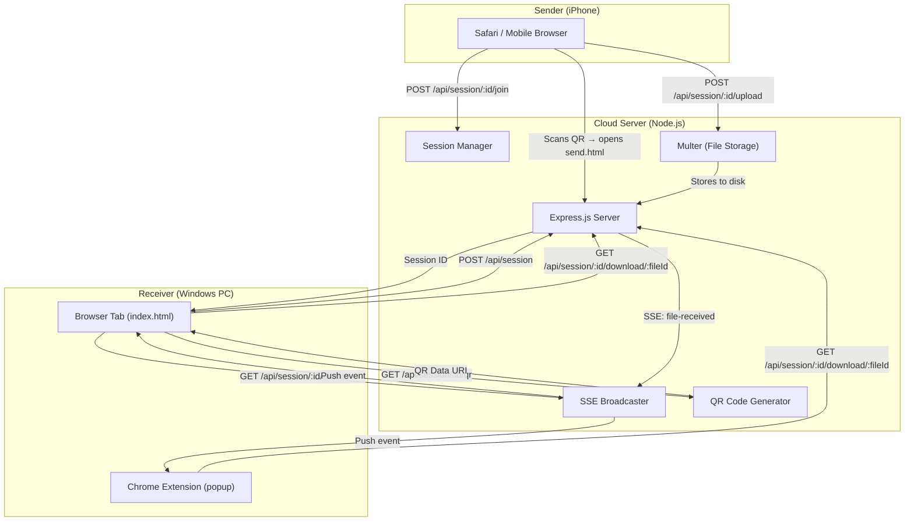
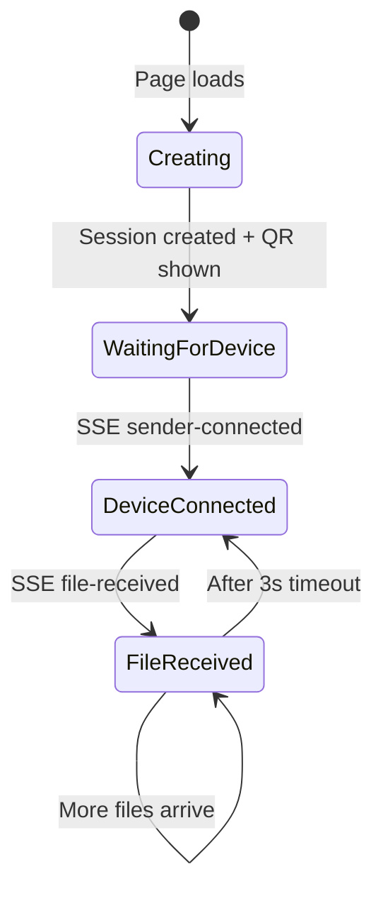
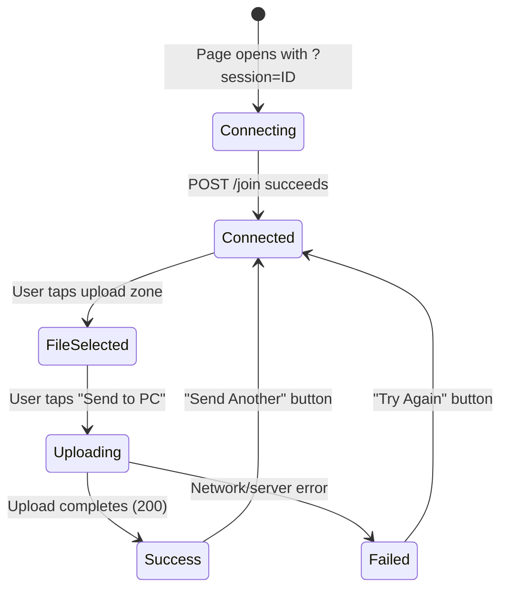
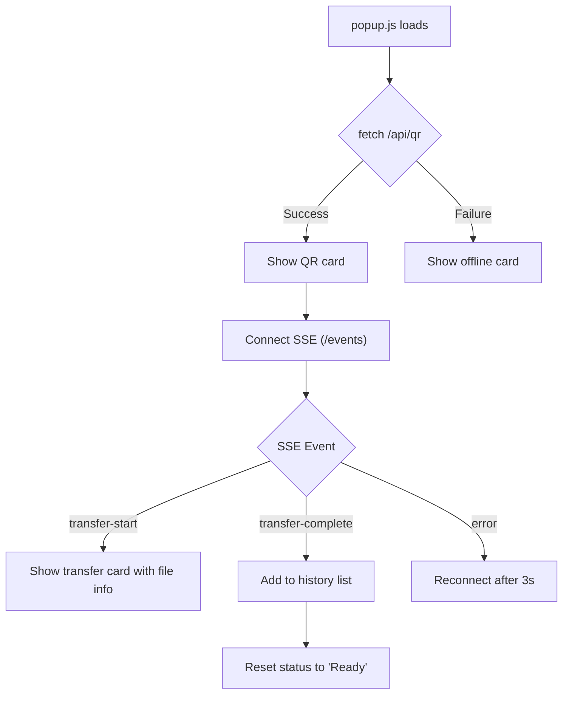
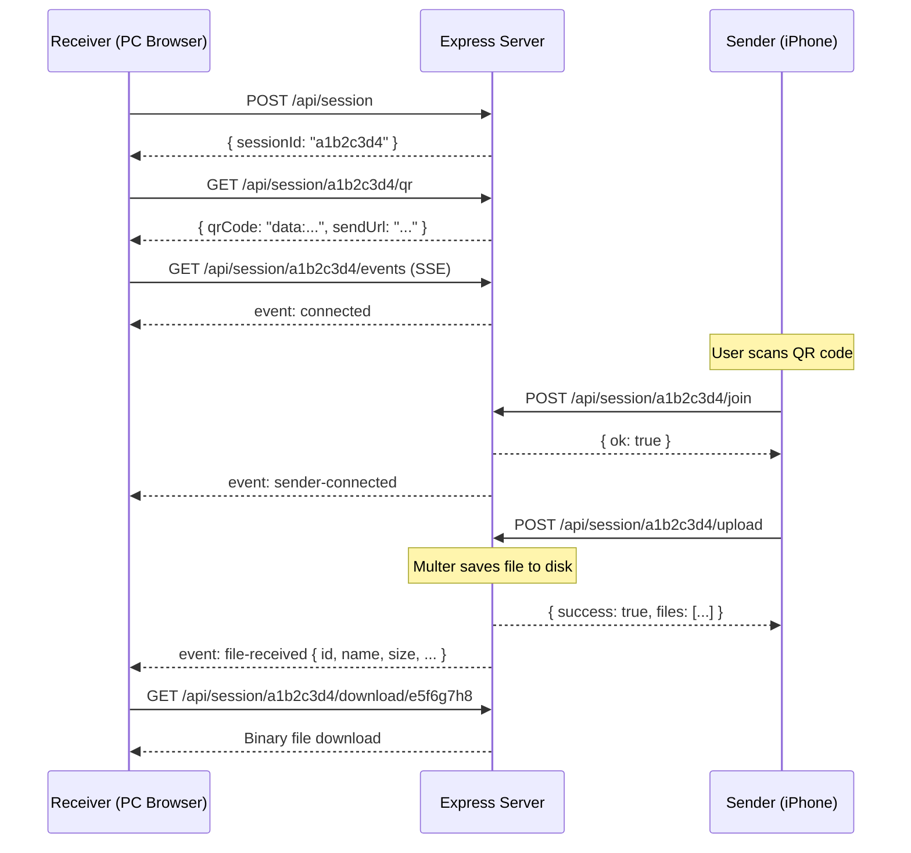

# WairPlay — Technical Documentation

> **Version:** 1.0.0  
> **Last Updated:** May 21, 2026  
> **Description:** AirDrop for Windows — send files from iPhone to PC via QR code (cloud relay)

---

## Table of Contents

1. [Overview](#overview)
2. [Architecture](#architecture)
3. [Directory Structure](#directory-structure)
4. [Technology Stack](#technology-stack)
5. [Backend — `server.js`](#backend--serverjs)
   - [Configuration](#configuration)
   - [Session Management](#session-management)
   - [API Reference](#api-reference)
   - [Server-Sent Events (SSE)](#server-sent-events-sse)
   - [File Storage](#file-storage)
6. [Web Frontend](#web-frontend)
   - [Receiver Page (`index.html`)](#receiver-page-indexhtml)
   - [Sender Page (`send.html`)](#sender-page-sendhtml)
   - [Design System (`style.css`)](#design-system-stylecss)
7. [Chrome Extension](#chrome-extension)
   - [Manifest](#manifest)
   - [Popup UI (`popup.html`)](#popup-ui-popuphtml)
   - [Popup Logic (`popup.js`)](#popup-logic-popupjs)
8. [Data Flow](#data-flow)
9. [Deployment](#deployment)
10. [Configuration & Environment](#configuration--environment)
11. [Limitations & Known Constraints](#limitations--known-constraints)

---

## Overview

**WairPlay** is a cross-platform file transfer application that emulates Apple's AirDrop functionality for Windows users. It enables users to send files from an iPhone (or any mobile device) to a Windows PC by scanning a QR code — no same-Wi-Fi requirement, no app installation on the phone.

The system operates on a **cloud relay model**: files are uploaded from the sender's device to a central server, which then makes them available for download by the receiver. Real-time communication between sender and receiver is handled through **Server-Sent Events (SSE)**.

---

## Architecture



### Flow Summary

| Step | Actor | Action |
|------|-------|--------|
| 1 | Receiver (PC) | Opens WairPlay in browser → creates a session |
| 2 | Server | Generates session ID + QR code encoding the sender URL |
| 3 | Receiver | Displays QR code; opens SSE connection for live events |
| 4 | Sender (iPhone) | Scans QR code → opens `send.html?session=<id>` |
| 5 | Sender | Joins the session via `POST /join` |
| 6 | Server | Broadcasts `sender-connected` event to receiver via SSE |
| 7 | Sender | Selects file(s) and uploads via `POST /upload` |
| 8 | Server | Stores files on disk; broadcasts `file-received` via SSE |
| 9 | Receiver | Receives SSE event; auto-downloads the file |

---

## Directory Structure

```
wairplay/
├── server.js                  # Express.js backend — all API routes & session logic
├── package.json               # NPM metadata & dependencies
├── package-lock.json          # Dependency lock file
├── .gitignore                 # Ignores: node_modules/, uploads/, .env
│
├── public/                    # Static files served by Express
│   ├── index.html             # Receiver page (PC opens this)
│   ├── send.html              # Sender page (iPhone opens via QR)
│   ├── favicon.svg            # App favicon
│   ├── css/
│   │   └── style.css          # Global design system & component styles
│   └── js/
│       ├── receiver.js        # Client logic for receiver page
│       └── sender.js          # Client logic for sender page
│
├── extension/                 # Chrome Extension (Manifest V3)
│   ├── manifest.json          # Extension manifest
│   ├── popup.html             # Extension popup UI (self-contained styles)
│   ├── popup.js               # Extension popup logic
│   └── icons/
│       ├── icon16.png         # 16×16 toolbar icon
│       ├── icon48.png         # 48×48 extension icon
│       └── icon128.png        # 128×128 Chrome Web Store icon
│
└── uploads/                   # Temporary file storage (git-ignored)
    └── <sessionId>/           # Per-session subdirectory
        └── <timestamp>-<filename>  # Uploaded files
```

---

## Technology Stack

| Layer | Technology | Purpose |
|-------|-----------|---------|
| **Runtime** | Node.js ≥ 18 | Server runtime |
| **Framework** | Express.js 4.x | HTTP server, routing, static file serving |
| **File Upload** | Multer 1.4.x | Multipart form handling & disk storage |
| **QR Generation** | qrcode 1.5.x | Generates QR code as Data URI |
| **CORS** | cors 2.8.x | Cross-origin request handling |
| **UUID** | uuid 11.x | Unique session & file ID generation |
| **Image Processing** | Jimp 0.22.x | Image manipulation (available, not actively used) |
| **Frontend** | Vanilla HTML/CSS/JS | No framework — lightweight client |
| **Extension** | Manifest V3 | Chrome browser extension |
| **Real-time** | SSE (Server-Sent Events) | Server → client push notifications |
| **Fonts** | Google Fonts (Outfit, Inter) | Typography |

---

## Backend — `server.js`

The entire backend is a single [server.js](file:///c:/Users/cyber/Downloads/wairplay/server.js) file — a monolithic Express.js application with no external routing or middleware layers.

### Configuration

| Constant | Value | Description |
|----------|-------|-------------|
| `PORT` | `process.env.PORT \|\| 3000` | Server listen port |
| `SESSION_TTL` | `30 * 60 * 1000` (30 min) | Session time-to-live |
| `UPLOADS_DIR` | `./uploads` | Disk path for temporary file storage |
| File size limit | 2 GB | Maximum upload size per file (Multer config) |
| Max files per upload | 50 | Maximum files in a single upload request |

### Session Management

Sessions are stored **in-memory** using a JavaScript `Map`. Each session object has the following shape:

```javascript
{
  id: "a1b2c3d4",          // 8-char UUID prefix
  created: 1716000000000,  // Date.now() timestamp
  files: [                 // Array of uploaded file metadata
    {
      id: "e5f6g7h8",
      name: "photo.jpg",
      savedAs: "1716000000-photo.jpg",
      size: 2048000,
      type: "image/jpeg",
      time: "2026-05-21T...",
      downloaded: false
    }
  ],
  sseClients: [],          // Array of active SSE response objects
  senderConnected: false   // Whether a sender has joined
}
```

**Lifecycle:**
1. **Creation** → `POST /api/session` generates an 8-character session ID
2. **TTL Check** → Every access validates `Date.now() - session.created < SESSION_TTL`
3. **Cleanup** → A `setInterval` runs every 5 minutes to purge expired sessions
4. **Cleanup Actions** → Closes all SSE connections, deletes uploaded files from disk, removes session from Map

### API Reference

#### `POST /api/session`
Creates a new transfer session.

- **Request Body:** None
- **Response:**
```json
{ "sessionId": "a1b2c3d4" }
```

---

#### `GET /api/session/:sessionId/qr`
Generates a QR code for the session's sender URL.

- **Response:**
```json
{
  "qrCode": "data:image/png;base64,...",
  "sendUrl": "https://host/send.html?session=a1b2c3d4",
  "sessionId": "a1b2c3d4"
}
```
- **QR Config:** 300px width, 2px margin, white on transparent
- **Errors:** `404` if session expired

---

#### `GET /api/session/:sessionId/status`
Returns the current status of a session.

- **Response:**
```json
{
  "sessionId": "a1b2c3d4",
  "senderConnected": true,
  "fileCount": 2,
  "files": [...]
}
```

---

#### `POST /api/session/:sessionId/join`
Called by the sender to pair with a session.

- **Side Effect:** Sets `senderConnected = true`, broadcasts `sender-connected` SSE event
- **Response:**
```json
{ "ok": true, "sessionId": "a1b2c3d4" }
```

---

#### `POST /api/session/:sessionId/upload`
Uploads one or more files to the session.

- **Content-Type:** `multipart/form-data`
- **Field Name:** `files` (up to 50 files)
- **Side Effect:** Stores files to disk, broadcasts `file-received` SSE event per file
- **Response:**
```json
{
  "success": true,
  "files": [
    { "id": "e5f6g7h8", "name": "photo.jpg", "size": 2048000, ... }
  ]
}
```

---

#### `GET /api/session/:sessionId/download/:fileId`
Downloads a specific file.

- **Response:** File binary with `Content-Disposition: attachment`
- **Side Effect:** Marks `fileEntry.downloaded = true`

---

#### `GET /api/session/:sessionId/events`
SSE endpoint — opens a persistent connection for real-time events.

- **Headers:** `Content-Type: text/event-stream`
- **Initial Event:** `connected` with session ID
- **Subsequent Events:** `sender-connected`, `file-received`

### Server-Sent Events (SSE)

The server uses SSE for one-way push communication from server to receiver(s). The [broadcast](file:///c:/Users/cyber/Downloads/wairplay/server.js#L113-L121) function iterates over all active `sseClients` for a given session and writes formatted SSE messages.

| Event Name | Trigger | Data Payload |
|------------|---------|--------------|
| `connected` | SSE connection opens | `{ sessionId }` |
| `sender-connected` | Sender calls `/join` | `{ time }` |
| `file-received` | File upload completes | Full file metadata object |

**SSE Message Format:**
```
event: file-received
data: {"id":"e5f6g7h8","name":"photo.jpg","size":2048000,...}

```

### File Storage

Files are stored on disk using Multer's `diskStorage` engine:

- **Path:** `uploads/<sessionId>/<timestamp>-<originalname>`
- **Naming:** Prefixed with `Date.now()` to prevent collisions
- **Cleanup:** Entire session directory is recursively deleted on session expiry via `fs.rmSync`

> [!WARNING]
> File storage is ephemeral. All uploaded files are deleted when the session expires (30 minutes) or when the server restarts. There is no persistent database.

---

## Web Frontend

The web frontend consists of two pages — one for the **receiver** (PC) and one for the **sender** (mobile). Both share a common [design system](file:///c:/Users/cyber/Downloads/wairplay/public/css/style.css).

### Receiver Page (`index.html`)

**File:** [public/index.html](file:///c:/Users/cyber/Downloads/wairplay/public/index.html) + [public/js/receiver.js](file:///c:/Users/cyber/Downloads/wairplay/public/js/receiver.js)

**Purpose:** Opened by the PC user. Creates a session, displays a QR code, and listens for incoming files.

**Lifecycle:**



**Key Behaviors:**
- **Auto-download:** When a `file-received` SSE event arrives, `triggerAutoDownload()` programmatically creates an invisible `<a>` element and clicks it to start the browser download immediately
- **Manual download:** Each file also renders a visible "Download" button card
- **URL copy:** Clicking the pairing URL copies it to clipboard (fallback for non-camera use)

### Sender Page (`send.html`)

**File:** [public/send.html](file:///c:/Users/cyber/Downloads/wairplay/public/send.html) + [public/js/sender.js](file:///c:/Users/cyber/Downloads/wairplay/public/js/sender.js)

**Purpose:** Opened on iPhone (via QR scan). Lets the user select and send files to the paired PC.

**Lifecycle:**



**Key Features:**
- **Multi-file support:** Users can select up to 50 files at once
- **Circular progress:** SVG-based ring animation showing upload percentage via `XMLHttpRequest.upload.progress`
- **Image preview:** Long-press on a selected image file shows a full-screen preview modal
- **Mobile-optimized:** Meta tags for `apple-mobile-web-app-capable`, no user scaling, touch-callout disabled
- **Upload timeout:** 10-minute timeout per upload (`xhr.timeout = 600000`)

### Design System (`style.css`)

**File:** [public/css/style.css](file:///c:/Users/cyber/Downloads/wairplay/public/css/style.css) — 610 lines

The design system uses a **glassmorphism** aesthetic with a dark theme and vibrant accent colors.

#### Design Tokens

| Token | Value | Usage |
|-------|-------|-------|
| `--bg-deep` | `#0a0a1a` | Page background |
| `--glass-bg` | `rgba(255,255,255,0.04)` | Card backgrounds |
| `--accent-cyan` | `#00d4ff` | Primary accent |
| `--accent-blue` | `#4a7dff` | Secondary accent |
| `--accent-purple` | `#a855f7` | Tertiary accent |
| `--accent-gradient` | `linear-gradient(135deg, cyan→blue→purple)` | Buttons, headings |
| `--success` | `#34d399` | Connected / complete states |
| `--warning` | `#fbbf24` | Waiting states |
| `--error` | `#f87171` | Error states |

#### Typography
- **Headings:** `Outfit` (Google Fonts) — 300-700 weights
- **Body:** `Inter` (Google Fonts) — 300-600 weights
- **Heading gradient:** All `<h1>` elements use `background-clip: text` with the accent gradient

#### Component Library

| Component | CSS Class(es) | Description |
|-----------|--------------|-------------|
| Glass Card | `.glass-card` | Frosted glass container with blur backdrop |
| Primary Button | `.btn-primary` | Gradient button with shimmer hover effect |
| Status Badge | `.status-badge`, `.status-badge--{state}` | Pill-shaped indicator (waiting/connected/transferring/complete/error) |
| Progress Bar | `.progress-container`, `.progress-fill` | Linear gradient progress with glow effect |
| Circular Progress | `.circular-progress` | SVG ring progress for mobile upload |
| File Upload Zone | `.file-upload-zone` | Dashed-border drop target |
| File Info | `.file-info` | Inline file metadata display |
| History List | `.history-list`, `.history-item` | Transfer history entries |
| Pulse Ring | `.pulse-ring` | Animated expanding ring effect |

#### Animations

| Animation | Duration | Usage |
|-----------|----------|-------|
| `fadeIn` | 0.5s | General fade entrance |
| `fadeSlideIn` | 0.4s | Slide up + fade (file cards, history items) |
| `slideUp` | 0.6s | Page entrance |
| `bgShift` | 20s | Ambient background opacity pulse |
| `statusPulse` | 2s | Status dot breathing effect |
| `progressGlow` | 1.5s | Progress bar trailing glow |
| `shimmer` | — | Button hover sweep |

---

## Chrome Extension

**Directory:** [extension/](file:///c:/Users/cyber/Downloads/wairplay/extension/)

The Chrome extension provides a compact popup interface for receiving files without keeping a browser tab open. It connects to the locally running WairPlay server.

### Manifest

**File:** [extension/manifest.json](file:///c:/Users/cyber/Downloads/wairplay/extension/manifest.json)

| Field | Value |
|-------|-------|
| `manifest_version` | 3 (Manifest V3) |
| `name` | WairPlay |
| `version` | 1.0.0 |
| `permissions` | *(none)* |
| `host_permissions` | `http://localhost:3000/*` |
| `action.default_popup` | `popup.html` |

> [!NOTE]
> The extension currently only communicates with `localhost:3000`. For production deployment, the `host_permissions` would need to include the deployed server URL.

### Popup UI (`popup.html`)

**File:** [extension/popup.html](file:///c:/Users/cyber/Downloads/wairplay/extension/popup.html) — 405 lines

The popup is a **self-contained** single file with all CSS inlined in a `<style>` block. It does not reference the shared `style.css` but replicates the same design language (glassmorphism, same color tokens, same typography).

**Fixed Dimensions:** 380px wide, minimum 420px tall

**UI Sections:**

| Section | Element ID | Visibility | Purpose |
|---------|-----------|------------|---------|
| Header | — | Always | Logo + app name |
| Status Badge | `statusBadge` | Always | Current connection state |
| Offline Card | `offlineCard` | When server unreachable | Shows "npm start" instruction |
| QR Card | `qrCard` | When connected to server | QR code with pulse animation |
| Transfer Card | `transferCard` | During active transfer | File name, progress bar, percentage |
| History Section | `historySection` | Always | List of received files |
| Footer | — | Always | Usage tip |

### Popup Logic (`popup.js`)

**File:** [extension/popup.js](file:///c:/Users/cyber/Downloads/wairplay/extension/popup.js) — 144 lines



> [!IMPORTANT]
> The extension's `popup.js` references endpoints (`/api/qr`, `/events`) that **differ** from the web app's session-based API (`/api/session/:id/qr`, `/api/session/:id/events`). This suggests the extension was designed for an earlier or alternative API surface that uses a single global session rather than multi-session management. Integration with the current session-based server would require updating these endpoint paths.

**Key Functions:**

| Function | Purpose |
|----------|---------|
| `init()` | Fetches QR from server, displays it, starts SSE |
| `connectSSE()` | Opens `EventSource` to `/events`, handles `transfer-start` and `transfer-complete` |
| `setStatus(type, text)` | Updates the status badge appearance |
| `addToHistory(name, size)` | Prepends a file entry to the history list |
| `formatSize(bytes)` | Converts bytes to human-readable string |
| `getFileIcon(mimeType)` | Returns emoji icon based on MIME type |

---

## Data Flow

### Complete Transfer Sequence



---

## Deployment

### Local Development

```bash
npm install
npm run dev     # Uses --watch flag for auto-restart
```

### Production (Render / Cloud)

```bash
npm start       # Runs: node server.js
```

**Environment Variables:**

| Variable | Default | Description |
|----------|---------|-------------|
| `PORT` | `3000` | Server port (auto-set by platforms like Render) |

**Platform Notes:**
- The server binds to `0.0.0.0` for container compatibility
- The QR code URL is dynamically constructed using `req.headers["x-forwarded-proto"]` and `req.headers.host` — this handles HTTPS termination behind reverse proxies
- File storage is ephemeral (disk-based); lost on container restart

### Loading the Chrome Extension

1. Navigate to `chrome://extensions/`
2. Enable **Developer mode**
3. Click **Load unpacked** → select the `extension/` directory
4. Ensure the WairPlay server is running on `localhost:3000`

---

## Configuration & Environment

| Item | Location | Details |
|------|----------|---------|
| Dependencies | [package.json](file:///c:/Users/cyber/Downloads/wairplay/package.json) | 6 runtime dependencies, no devDependencies |
| Git Ignores | [.gitignore](file:///c:/Users/cyber/Downloads/wairplay/.gitignore) | `node_modules/`, `uploads/`, `.env` |
| Node Version | `package.json` engines | `>=18` required |
| CORS | `server.js` L12 | Globally permissive (`cors()` with defaults) |

---

## Limitations & Known Constraints

| Constraint | Detail |
|------------|--------|
| **In-memory sessions** | Sessions are stored in a `Map`; lost on server restart. No database persistence. |
| **Ephemeral file storage** | Uploaded files are stored on disk and deleted after 30 minutes or on restart. |
| **Single-server only** | No horizontal scaling support — SSE connections and session state are per-process. |
| **No authentication** | Sessions are protected only by their 8-character ID. No auth tokens or passwords. |
| **Extension API mismatch** | The Chrome extension references a different API surface (`/api/qr`, `/events`) than the current session-based server. |
| **No drag-and-drop** | The sender page uses a file input; no drag-and-drop support (primarily mobile-targeted). |
| **No encryption** | Files are transmitted over HTTPS (if deployed) but not end-to-end encrypted. |
| **2 GB file limit** | Multer is configured with a 2 GB per-file limit. |
| **No resume support** | Interrupted uploads cannot be resumed; the user must start over. |
